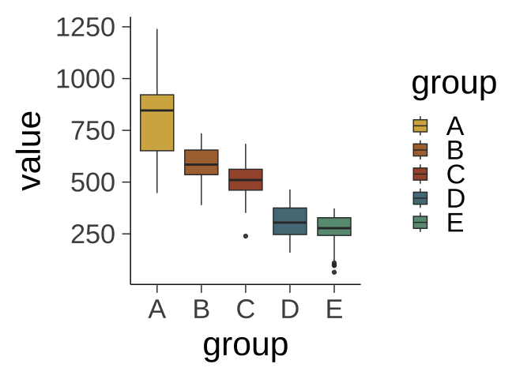

<!-- README.md is generated from README.Rmd. Please edit that file -->

# poisonfrogs 

<!-- badges: start -->

<!-- badges: end -->

`poisonfrogs` is a extensive collection of colour palettes inspired in
species and morphs of Neotropical poison frogs. And more and more…

## Installation

You can install the development version of poisonfrogs from
[GitHub](https://github.com/) with:

``` r
# install.packages("pak")
pak::pak("laurenoconnelllab/poisonfrogs")
```

## Example

I will make nice examples here.

``` r

require(tidyverse)

example_data <- tibble(
  group = factor(rep(c("A", "B", "C", "D", "E"), each = 50)),
  value = c(
    rnorm(50, mean = 800, sd = 160), # group A
    rnorm(50, mean = 600, sd = 90), # group B
    rnorm(50, mean = 500, sd = 80), # group C
    rnorm(50, mean = 300, sd = 80), # group D
    rnorm(50, mean = 270, sd = 80) # group E
  )
)
#discrete scale
ggplot(example_data, aes(group, value, fill = group)) +
  geom_boxplot(alpha = 0.9) +
  theme_classic(base_size = 32, base_line_size = 0.5) +
  scale_fill_poison(
    "ranitomeya3",
    type = "discrete",
    alpha = 0.95,
    direction = -1
  )
```



You’ll still need to render `README.Rmd` regularly, to keep `README.md`
up-to-date. `devtools::build_readme()` is handy for this.

You can also embed plots, for example:

In that case, don’t forget to commit and push the resulting figure
files, so they display on GitHub and CRAN.
