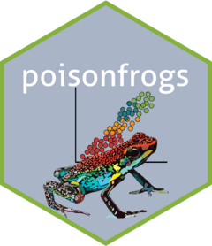
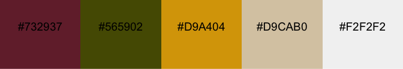
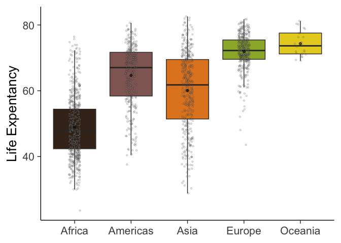
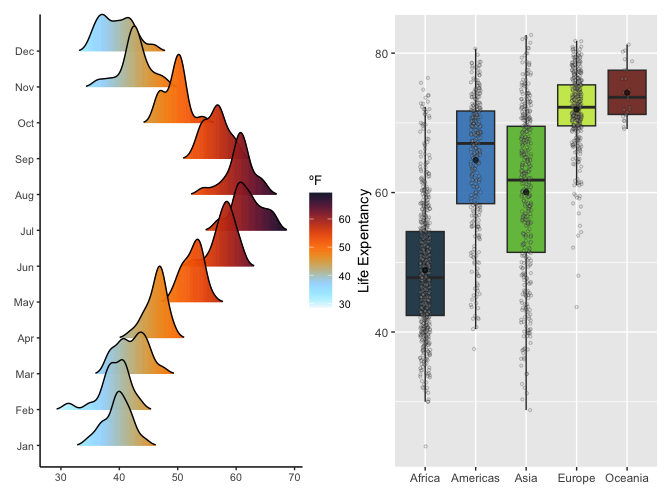

<!-- README.md is generated from README.Rmd. Please edit that file -->

# Color Palettes Inspired in Neotropical Poison Frogs 

<!-- badges: start -->

[](https://github.com/laurenoconnelllab/poisonfrogs/actions/workflows/R-CMD-check.yaml)

[](https://lifecycle.r-lib.org/articles/stages.html#stable)

<!-- badges: end -->

A collection of 31 colour palettes inspired in Neotropical poison frogs.
With more than 200 brighly colored species, Neotropical poison frogs
paint the rain forest in vivid hues that shout a clear message: “I’m
toxic!”. Spice up your plots with `poisonfrogs` and give your dataviz a
toxic twist! But wait, we also included 11 color palettes inspired on
other pretty frog species, because… why not?

## Installation

You can install `poisonfrogs` from CRAN:

``` r
install.packages("poisonfrogs")
```

or from the development version in
[GitHub](https://github.com/laurenoconnelllab/poisonfrogs) with:

``` r
remotes::install_github("laurenoconnelllab/poisonfrogs")
```

load the package:

``` r
library(poisonfrogs)
```

## Poison frog color palettes “*At a glance*”


## Meet the frogs and their colors

## *Allobates femoralis*

Inspired after the brilliant-thighed
poison frog, *Allobates femoralis*, from the Nouragues rainforest in
French Guiana.

## *Andinobates fulguritus*

Inspired after the Yellow-bellied poison
frog, *Andinobates fulguritus*, from the Pacífic rainforest in Colombia.

## *Andinobates minutus*

Inspired after the Blue-bellied poison
frog, *Andinobates minutus*, from the Pacífic rainforest in Colombia.

## *Ameerega macero*

Inspired after the Blue-bellied poison frog,
*Andinobates minutus*, from the Pacífic rainforest in Colombia.

## *Ameerega shihuemoy*

Inspired after the Amarakaeri poison
frog, *Ameerega shihuemoy*, from the Peruvian rainforest in the Manú
district.

## *Ameerega trivittata*

 Inspired after the three-striped poison
frog, *Ameerega trivittata*, from the Amazon rainforest of the Tanimboca
reserve, Colombia.

## *Dendrobates auratus*

 Inspired after the three-striped poison
frog, *Dendrobates auratus*, from the Pacífic rainforest in Colombia.

## *Dendrobates tinctorius “alanis”*

 Inspired after the Dyeing poison frog,
*Dendrobates tinctorius “alanis”*, from the Nouragues rainforest in
French Guiana.

## *Dendrobates tinctorius “azureus”*

 Inspired after the Blue poison frog,
*Dendrobates tinctorius “azureus”*, from the rainforest in Suthern
Surinam.

## *Epipedobates anthonyi*

 Inspired after the Anthony’s poison frog,
*Epipedobates anthonyi*, from the rainforest in Ecuador and Perú.

## *Epipedobates darwinwallacei*

 Inspired after the Darwin-Wallace
poison frog, *Epipedobates darwinwallacei*, from the rainforest in
Ecuador.

## *Epipedobates tricolor*

 Inspired after the phantasmal poison
frog, *Epipedobates tricolor*, from the rainforest in Ecuador.

## *Oophaga anchicayensis*

 Inspired after the Anchicayá poison
frog, *Oophaga anchicayensis*, from the rainforest in western Colombia.

## *Oophaga histrionica*

 Inspired after the harlequin poison
frog, *Oophaga histrionica*, from the rainforest in western Colombia.

## *Oophaga lehmanni*

 Inspired after the Lehmann’s poison frog,
*Oophaga lehmanni*, from the rainforest in western Colombia.

## *Oophaga pumilio “bluejeans”*

 Inspired after the strawberry poison
frog, *Oophaga pumilio “bluejeans”*, from the rainforest in Central
America.

## *Oophaga pumilio “colón”*

 Inspired after the strawberry poison frog,
*Oophaga pumilio “colón”*, from the Isla Colón in Bocas del Toro,
Panamá.

## *Oophaga pumilio “escudo”*

 Inspired after the strawberry poison frog,
*Oophaga pumilio “escudo”*, from the Isla Escudo de Veraguas in Bocas
del Toro, Panamá.

## *Oophaga pumilio “loma”*

 Inspired after the strawberry poison frog,
*Oophaga pumilio “loma”*, from the Isla Loma Partida in Bocas del Toro,
Panamá.

## *Oophaga pumilio “sancristobal”*

 Inspired after the strawberry poison
frog, *Oophaga pumilio “sancristobal”*, from the Isla San Cristóbal in
Bocas del Toro, Panamá.

## *Oophaga pumilio “uyama”*

 Inspired after the strawberry poison frog,
*Oophaga pumilio “uyama”*, from the Río Uyama in Bocas del Toro, Panamá.

## *Oophaga sylvatica “colón”*

 Inspired after the little devil poison
frog, *Oophaga sylvatica “colón”*, from the Cristobal Colón population
in Ecuador.

## *Oophaga sylvatica “koi”*

 Inspired after the little devil poison frog,
*Oophaga sylvatica “koi”*, from the “koi” population in Nariño,
Colombia.

## *Oophaga sylvatica “lita”*

 Inspired after the little devil poison frog,
*Oophaga sylvatica “lita”*, from the Lita population in Ecuador.

## *Oophaga sylvatica “otokiki”*

 Inspired after the little devil poison
frog, *Oophaga sylvatica “otokiki”*, from the Otokiki population in
Ecuador.

## *Oophaga sylvatica “sanantonio”*

 Inspired after the little devil poison
frog, *Oophaga sylvatica “sanantonio”*, from the San Antonio population
in Ecuador.

## *Oophaga sylvatica “Ceiba”*

 Inspired after the little devil poison
frog, *Oophaga sylvatica “Ceiba”*, from the Ceiba population in Ecuador.

## *Phyllobates terribilis*

 Inspired after the golden poison frog,
*Phyllobates terribilis*, from the rainforest in Cauca, Colombia.

## *Ranitomeya amazonica*

 Inspired after the Amazonian poison
frog, *Ranitomeya amazonica*, from the Amazon rainforest of the
Tanimboca reserve, Colombia.

## *Ranitomeya imitator “striped”*

 Inspired after the mimic poison frog,
*Ranitomeya imitator “striped”*, from the rainforest in Perú.

## *Ranitomeya imitator “banded”*

 Inspired after the mimic poison frog,
*Ranitomeya imitator “banded”*, from the rainforest in Perú.

## *Ranitomeya variabilis*

 Inspired after the Zimmerman’s poison
frog, *Ranitomeya variabilis*, from the rainforest in Perú.

## Other frog species

## *Boana picturata*

 Inspired after the Imbabura tree frog,
*Boana picturata*, from the Pacific lowlands in Colombia and Ecuador.

## *Dendropsophus sarayacuensis*

 Inspired after the Shreve’s Sarayacu
tree frog, *Dendropsophus sarayacuensis*, from the Amazon rainforest of
the Tanimboca reserve, Colombia.

## *Hypsiboas cinerascens*

 Inspired after the Demerara Falls tree
frog, *Hypsiboas cinerascens*, from the Amazon rainforest of the
Tanimboca reserve, Colombia.

## *Hypsiboas hobbsi*

 Inspired after the Hobbs’ tree frog,
*Hypsiboas hobbsi*, from the Amazon rainforest of the Tanimboca reserve,
Colombia.

## *Hyalinobatrachium aureoguttatum*

 Inspired after the Sun glass frog,
*Hyalinobatrachium aureoguttatum*, from the rainforest in Ecuador.

## *Lithodythes lineatus*

 Inspired after the Gold-striped frog,
*Lithodythes lineatus*, from the Amazon rainforest of the Tanimboca
reserve, Colombia.

## *Mantela laevigata*

 Inspired after the climbing mantella,
*Mantela laevigata*, from subtropical forest in Madagascar.

## *Phyllomedusa tomopterna*

 Inspired after the tiger-striped tree
frog, *Phyllomedusa tomopterna*, from the Amazon rainforest of the
Tanimboca reserve, Colombia.

## *Phyllomedusa vaillantii*

 Inspired after the white-lined leaf
frog, *Phyllomedusa vaillantii*, from the Amazon rainforest of the
Tanimboca reserve, Colombia.

## *Rhinella marina*

 Inspired after the cane toad, *Rhinella
marina*, from the Nouragues rainforest in French Guiana.

## Usage

To call the names of all the 42 colour palettes in poisonfrogs:

``` r
poison_palettes_names()
#>  [1] "Afemoralis"      "Afulguritus"     "Amacero"         "Aminutus"       
#>  [5] "Ashihuemoy"      "Atrivittata"     "Bpicturata"      "Dauratus"       
#>  [9] "Dsarayacuensis"  "Dtalanis"        "Dtazureus"       "Eanthonyi"      
#> [13] "Edarwinwallacei" "Etricolor"       "Haureoguttatum"  "Hcinerascens"   
#> [17] "Hhobbsi"         "Llineatus"       "Mlaevigata"      "Oanchicayensis" 
#> [21] "Ohistrionica"    "Olehmanni"       "Opbluejeans"     "Opcolon"        
#> [25] "Opescudo"        "Oploma"          "Opsancristobal"  "Opuyama"        
#> [29] "Osceiba"         "Oscolon"         "Oskoi"           "Oslita"         
#> [33] "Osotokiki"       "Ossanantonio"    "Pterribilis"     "Ptomopterna"    
#> [37] "Pvaillantii"     "Ramazonica"      "Ribanded"        "Ristriped"      
#> [41] "Rmarina"         "Rvariabilis"
```

Plot poison frog palettes and print the hex codes of the colours in
every palette:

``` r
# plot palette with hex codes
poison_palette("Haureoguttatum")
```



``` r

# get hex codes for a vector
cols <- poison_palette("Dtalanis", return = "vector")

cols
#> [1] "#090B0A" "#263F48" "#499AC1" "#EEA715" "#FED126"
```

## Examples

### Continuos scale

``` r

require(tidyverse)
require(gapminder)
require(gridExtra)
require(ggridges)

#continuous scale

df_nottem <- tibble(
  year  = floor(time(nottem)),
  month = factor(month.abb[cycle(nottem)], levels = month.abb),
  temp  = as.numeric(nottem)
)

p1 <- ggplot(df_nottem, aes(x = temp, y = month, fill = after_stat(x))) +
  geom_density_ridges_gradient(scale = 2, rel_min_height = 0.01) +
  scale_fill_poison(
    name = "Oskoi",
    type = "continuous",
    alpha = 0.95,
    direction = -1) +
  labs(
  fill = "ºF",
  y = NULL,
  x = NULL) +
  theme_classic(base_size = 20, base_line_size = 0.5) +
  theme(legend.position = "right", legend.justification = "left",
  legend.margin = margin(0,0,0,0),
  legend.box.margin = margin(-5,-5,-5,-5)) +
  coord_cartesian(clip = "off")

p1
```


### Discrete scale 1

``` r

#discrete scale 1
p2 <- ggplot(gapminder, aes(x = continent, y = lifeExp, fill = continent)) +
  geom_boxplot(alpha = 0.95, outliers = F) +
  geom_jitter(
    shape = 21,
    position = position_jitter(0.1),
    alpha = 0.2,
    size = 0.8,
    bg = "grey"
  ) +
  stat_summary(
    fun = mean,
    geom = "point",
    size = 1.5,
    color = "black",
    alpha = 0.6
  ) +
  theme_classic(base_size = 20, base_line_size = 0.5) +
  scale_fill_poison(
    name = "Oanchicayensis",
    type = "discrete",
    alpha = 0.95,
    direction = -1
  ) +
  theme(legend.position = "none") +
  xlab(NULL) +
  ylab("Life Expentancy")

p2
```



### Discrete scale 2

``` r
#discrete scale 2
p3 <- ggplot(gapminder, aes(x = lifeExp, y = log(gdpPercap), colour = continent)) +
  geom_point(alpha = 0.2) +
  scale_colour_poison(name = "Ramazonica", type = "discrete") +
  stat_smooth() +
  facet_wrap(.~continent, scales = "free") +
  theme_minimal(20, base_line_size = 0.2) +
  theme(legend.position = "none",
  strip.background = element_blank(), strip.placement = "outside") 

p3
```


