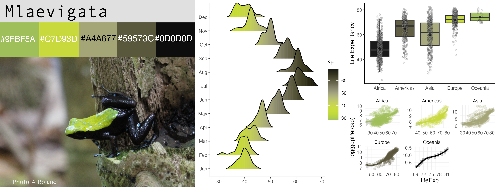

```{r, include = FALSE}
knitr::opts_chunk$set(
  collapse = TRUE,
  comment = "#>",
  fig.path = "pkgdown/assets/web-",
  out.width = "100%"
)
```

Meet the species and populations that inspired this package:

## *Allobates femoralis*

Inspired after the brilliant-thighed poison frog, *Allobates femoralis*, from the Nouragues rainforest in French Guiana.
 
## *Andinobates fulguritus*

Inspired after the Yellow-bellied poison frog, *Andinobates fulguritus*, from the Pacífic rainforest in Colombia.

## *Andinobates minutus*

Inspired after the Blue-bellied poison frog, *Andinobates minutus*, from the Pacífic rainforest in Colombia.

## *Ameerega macero*

Inspired after the Blue-bellied poison frog, *Andinobates minutus*, from the Pacífic rainforest in Colombia.

## *Ameerega shihuemoy*

Inspired after the Amarakaeri poison frog, *Ameerega shihuemoy*, from the Peruvian rainforest in the Manú district.

## *Ameerega trivittata*

 Inspired after the  three-striped poison frog, *Ameerega trivittata*, from the Amazon rainforest of the Tanimboca reserve, Colombia.

## *Dendrobates auratus*

 Inspired after the  three-striped poison frog, *Dendrobates auratus*, from the Pacífic rainforest in Colombia.

## *Dendrobates tinctorius "alanis"*

 Inspired after the Dyeing poison frog, *Dendrobates tinctorius "alanis"*, from the Nouragues rainforest in French Guiana.

## *Dendrobates tinctorius "azureus"*

 Inspired after the Blue poison frog, *Dendrobates tinctorius "azureus"*, from the rainforest in Suthern Surinam.

## *Epipedobates anthonyi*

 Inspired after the Anthony's poison frog, *Epipedobates anthonyi*, from the rainforest in Ecuador and Perú.

## *Epipedobates darwinwallacei*

 Inspired after the Darwin-Wallace poison frog, *Epipedobates darwinwallacei*, from the rainforest in Ecuador.

## *Epipedobates tricolor*

 Inspired after the phantasmal poison frog, *Epipedobates tricolor*, from the rainforest in Ecuador.

## *Oophaga anchicayensis*

 Inspired after the Anchicayá poison frog, *Oophaga anchicayensis*, from the rainforest in western Colombia.

## *Oophaga histrionica*

 Inspired after the harlequin poison frog, *Oophaga histrionica*, from the rainforest in western Colombia.

## *Oophaga lehmanni*

 Inspired after the Lehmann's poison frog, *Oophaga lehmanni*, from the rainforest in western Colombia.

## *Oophaga pumilio "bluejeans"*

 Inspired after the strawberry poison frog, *Oophaga pumilio "bluejeans"*, from the rainforest in Central America.

## *Oophaga pumilio "colón"*

 Inspired after the strawberry poison frog, *Oophaga pumilio "colón"*, from the Isla Colón in Bocas del Toro, Panamá.

## *Oophaga pumilio "escudo"*

 Inspired after the strawberry poison frog, *Oophaga pumilio "escudo"*, from the Isla Escudo de Veraguas in Bocas del Toro, Panamá.

## *Oophaga pumilio "loma"*

 Inspired after the strawberry poison frog, *Oophaga pumilio "loma"*, from the Isla Loma Partida in Bocas del Toro, Panamá.

## *Oophaga pumilio "sancristobal"*

 Inspired after the strawberry poison frog, *Oophaga pumilio "sancristobal"*, from the Isla San Cristóbal in Bocas del Toro, Panamá.

## *Oophaga pumilio "uyama"*

 Inspired after the strawberry poison frog, *Oophaga pumilio "uyama"*, from the Río Uyama in Bocas del Toro, Panamá.

## *Oophaga sylvatica "colón"*

 Inspired after the little devil poison frog, *Oophaga sylvatica "colón"*, from the Cristobal Colón population in Ecuador.

## *Oophaga sylvatica "koi"*

 Inspired after the little devil poison frog, *Oophaga sylvatica "koi"*, from the "koi" population in Nariño, Colombia.

## *Oophaga sylvatica "lita"*

 Inspired after the little devil poison frog, *Oophaga sylvatica "lita"*, from the Lita population in Ecuador.

## *Oophaga sylvatica "otokiki"*

 Inspired after the little devil poison frog, *Oophaga sylvatica "otokiki"*, from the Otokiki population in Ecuador.

## *Oophaga sylvatica "sanantonio"*

 Inspired after the little devil poison frog, *Oophaga sylvatica "sanantonio"*, from the San Antonio population in Ecuador.

## *Oophaga sylvatica "Ceiba"*

 Inspired after the little devil poison frog, *Oophaga sylvatica "Ceiba"*, from the Ceiba population in Ecuador.

## *Phyllobates terribilis*

 Inspired after the golden poison frog, *Phyllobates terribilis*, from the rainforest in Cauca, Colombia.

## *Ranitomeya amazonica*

 Inspired after the Amazonian poison frog, *Ranitomeya amazonica*, from the Amazon rainforest of the Tanimboca reserve, Colombia.

## *Ranitomeya imitator "striped"*

 Inspired after the mimic poison frog, *Ranitomeya imitator "striped"*, from the rainforest in Perú.

## *Ranitomeya imitator "banded"*

 Inspired after the mimic poison frog, *Ranitomeya imitator "banded"*, from the rainforest in Perú.

## *Ranitomeya variabilis*

 Inspired after the Zimmerman's poison frog, *Ranitomeya variabilis*, from the rainforest in Perú.

## Other frog species

## *Boana picturata*

 Inspired after the Imbabura tree frog, *Boana picturata*, from the Pacific lowlands in Colombia and Ecuador.

## *Dendropsophus sarayacuensis*

 Inspired after the Shreve's Sarayacu tree frog, *Dendropsophus sarayacuensis*, from the Amazon rainforest of the Tanimboca reserve, Colombia.

## *Hypsiboas cinerascens*

 Inspired after the Demerara Falls tree frog, *Hypsiboas cinerascens*, from the Amazon rainforest of the Tanimboca reserve, Colombia.

## *Hypsiboas hobbsi*

 Inspired after the Hobbs' tree frog, *Hypsiboas hobbsi*, from the Amazon rainforest of the Tanimboca reserve, Colombia.

## *Hyalinobatrachium aureoguttatum*

 Inspired after the Sun glass frog, *Hyalinobatrachium aureoguttatum*, from the rainforest in Ecuador.

## *Lithodythes lineatus*

 Inspired after the Gold-striped frog, *Lithodythes lineatus*, from the Amazon rainforest of the Tanimboca reserve, Colombia.

## *Mantela laevigata*

 Inspired after the climbing mantella, *Mantela laevigata*, from subtropical forest in Madagascar.

## *Phyllomedusa tomopterna*

 Inspired after the tiger-striped tree frog, *Phyllomedusa tomopterna*, from the Amazon rainforest of the Tanimboca reserve, Colombia.

## *Phyllomedusa vaillantii*

 Inspired after the white-lined leaf frog, *Phyllomedusa vaillantii*, from the Amazon rainforest of the Tanimboca reserve, Colombia.

## *Rhinella marina*

 Inspired after the cane toad, *Rhinella marina*, from the Nouragues rainforest in French Guiana.